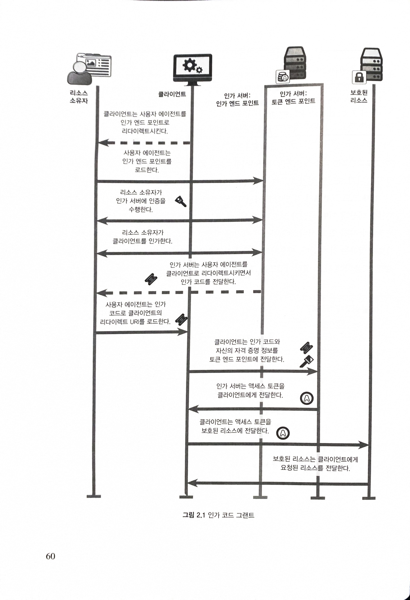

# Chapter 02. OAuth 2.0 의 기본

## 2.1 OAuth 2.0 프로토콜의 개요: 토큰 획득과 사용

- OAuth 트랜잭션의 2개의 중요한 단계
  - 토큰을 발급하고 발급된 토ㄴ을 사용하는 것
  - 토큰은 클라이언트에게 위임된 접근 권한을 의미
- 표준 OAuth 트랜잭션은 다음과 같은 일련의 이벤트로 구성
  - 리소스 소유자는 클라이언트에게 자신을 대신해 작업을 수행하라고 말함
  - 클라이언트는 인가 서버의 리소스 소유자에게 인가를 요청
  - 리소스 소유자는 클라이언트를 인가
  - 클라이언트는 인가 서버로부터 토큰을 전달 받음
  - 클라이언트는 보호된 리소스에 접근하기 위해 토큰을 사용

## 2.2 인가 그랜트

- 리소스 사유자가 클라이언트에게 접근 권한을 위임했다는 것을 나타내기 위해 임시 자격 증명인 인가 코드를 사용

0. 리소스 소유자는 클라이언트에게 자신을 대신해 어떤 특정한 보호된 리소스에 접근해 작업을 수행하라고 말함
1. 리소스 소유자의 권한 일부를 자신에게 위임해달라고 요청하기 위해 리소소스 소유자를 인가 서버의 인가 엔드포인트로 리다이렉트
   - `Location: https://localhost:9001/authorize?response_type=codescope=foo&client_ id=oauth-client-1&redirect uri=http:3A:2F:2Flocalhost°3A9000%2Fcallback&state=Lwt5ODDQKUB8U7jtfLQCVGDL9cmwHH1`
   - 해당 인가 서버의 엔드포인트로 HTTP GET
   - 클라이언트는 자신을 식별하며, URL 의 쿼리 파라미터로 권한 버무이와 같은 특정 아이템을 전달
   - 클라이언트가 직접 해당 쿼리를 전달하고 있지 않음에도 불구하고 인가 서버는 전달된 파라미터를 분석해 그에 맞는 작업을 수행
2. 인가 서버는 사용자 인증을 요구
   - 리소스 소유자가 누구인지 판단하고 해당 사용자가 클라이언트에게 어떤 권한을 위임해줄 수 있는지 확인
   - 리소스 소유자는 웹 브라우저를 이용해 인가 엔드 포인트와 직접적으로 상호 작용하기 때문에 인증 작업 또한 웹 브라우저를 통해 이뤄지고, 따라서 사용자 인증을 위해 다양한 종류의 인증 기술을 이용할 수 있음
3. 사용자는 클라이언트 애플리케이션을 인가
4. 인가 서버가 사용자를 클라이언트 애플리케이션으로 리다이렉트
   - `Location: http://localhost:9000/oauth_callback?code=8V1pr0rJ&state=Lwt50DDQKUB8U7j†fLQCVGDL9cnmwHH1`
   - code 라는 파라미터 포함됨(인가 코드 authorization code)
   - `인가 코드 authorization code`: 일회용 자격 증명 데이터로서 사용자가 클라이언트에게 권한을 위임했음을 나타냄
   - 클라이언트는 또한 state 파라미터 값이 이전에 자신이 보낸 것과 동일한 것인지 확인
5. 클라이언트가 인가 코드를 획득하면 그것을 다시 인가 서버의 토큰 엔드 포인트로 전달
   - 인코딩된 폼의 파라미터로 전달하고자 하는 파라미터를 HTTP POST 로 전달하고, client_id 와 client_secret 는 HTTP Basic 인가 헤더로 전달
   - 웹 브라우저나 리소스 소유자와는 상관없이 클라이언트와 인가 서버 사이에 직접 이뤄짐
6. 인가 서버는 전달된 클라이언트의 토큰 요청이 유효하면 토큰을 발급
   - 어느 클라이언트가 접근 권한을 요청했는지 판단하기 위해 클라이언트의 자격 증명 데이터(Authorization 헤더로 전달)를 확인
   - code 파라미터를 읽어 인가 코드와 연관된 정보를 확인 -> 어느 클라이언트가 인가를 요청한 것인지, 어느 사용자가 인가한 것인지, 무엇을 위한 인가인지
   - 인가 코드가 유효하고, 이전에 사용된 적이 없으며, 질의를 요청한 클라이언트가 원래 권한을 요청한 클라이언트와 같다고 판단되면 인가 서버는 새로운 액세스 토큰을 생성해 그것을 클라이언트에게 전달
7. 클라이언트는 토큰 응답을 분석해 액세스 토큰 값을 추출하고 그것을 이용해 보호된 리소스에 접근

## 2.3 OAuth 의 구성원: 클라이언트, 인가 서버, 리소스 소유자 그리고 보호된 리소스

## 2.4 OAuth의 구성 요소: 토큰, 범위 그리고 인가 그랜트

### 2.4.1 액세스 토큰(Access Token)

- 클라이언트에게 권한이 위임됐다는 것을 나타내기 위해 인가 서버가 클라이언트에게 발급
- OAuth 에서는 토큰의 포맷이나 내용을 정의하지 않음
- 클라이언트가 요청한 접근 권한, 리소스 소유자의 클라이언트 인가, 인가 과정에서 클라이언트에게 부여된 권한을 나타냄
- 클라이언트가 볼 때 OAuth 토큰의 형식은 명확하지 않고 클라이언트는 토큰 자체를 분석할 필요가 없음
- 인가 서버와 보호된 리소스는 토큰 자체를 이해할 수 있으며, 그것이 어떤 내용을 의미하는지 알 수 있음
- 그렇게 함으로써 클라이언트가 좀 더 단순해지고 인가 서버와 보호된 리소스는 토큰을 배포하는 방법에 있어 엄청난 유연성을 얻을 수 있음

### 2.4.2 범위(Scope)

- 보호된 리소스에 대한 접근 권한
- Scope 의 포맷과 구조가 OAuth 스펙에 정의된 것은 아님

### 2.4.3 리프레시 토큰(Refresh Token)

- 보호된 리소스에 전달되지 않음
- 클라이언트는 리소스 소유자와 관련없이 새로운 액세스 토큰을 요청
- 접근 권한을 축소시킬 수도 있음

### 2.4.4 인가 그랜트(Authorization Grant)

- OAuth 프로토콜을 이용해 OAuth 클라이언트에게 보호된 리소스에 대한 접근 권한을 위임해주기 위한 방법이며, 그것이 성공적으로 이뤄지면 클라이언트는 최종적으로 액세스 토큰을 얻게 됨
- 토큰을 획득하기 위한 방법
- 사용자가 권한을 위임하는 특정 메커니즘을 나타낼 뿐만 아니라 권한 위임 행위 자체도 나타냄
- Authorization Code Grant 와 구분
  - 인가 코드는 사용자의 권한 위임 결정을 의미하기는 하지만, 그것 자체가 인가 그랜트는 아님

## 2.5 OAuth 의 구성원과 구성 요소 간의 상호 작용: 백 채널, 프론트 채널, 엔드 포인트

### 2.5.1 백 채널 통신

### 2.5.2 프론트 채널 통신

- 프론터 채널을 통해 전달되는 모든 정보는 웹 브라우저가 접근 가능하므로 그 내용을 읽거나 쿼리가 전송되기 전에 쿼리 내용이 조작될 잠재적인 가능성 존재
- 그러므로 OAuth 프로토콜은 프론트 채널을 통해 전달되는 정보의 종류를 제한하고 프론트 채널에서 사용된 어떤 정보도 단독으로 권한 위임 작업을 위해 사용될 수 없도록 함
