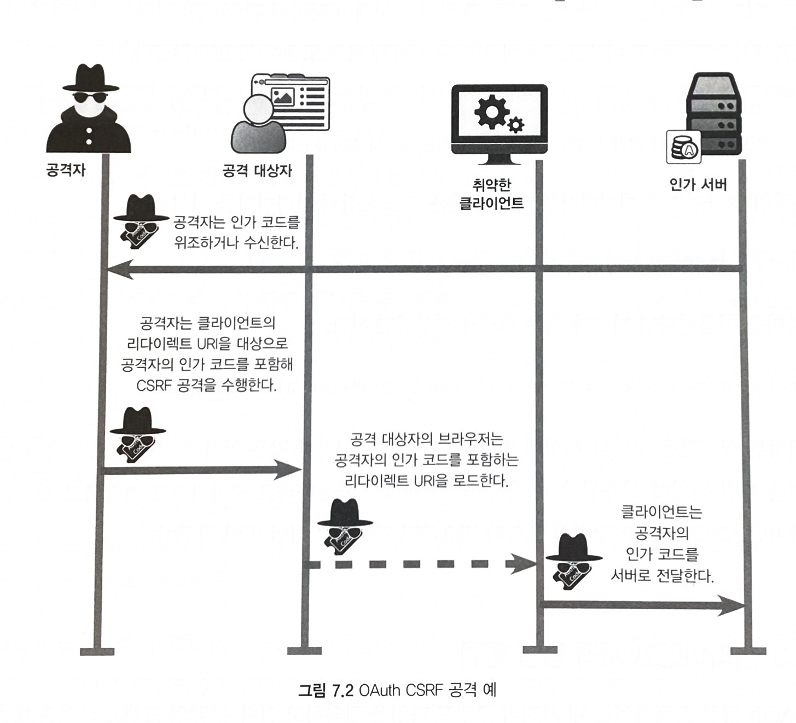

# Chapter 07. 일반적인 클라이언트 보안 취약점

## 7.1 일반적인 클라이언트 보안

- 클라이언트 시크릿이 있다면 외부에서 그것에 쉽게 접근할 수 없는 안전한 곳에 저장되는지 확인해야 함
  - 액세스 토큰과 리프레시 토큰을 수집할 떄와 마찬가지로 클라이언트 소프트웨어 외부의 구성 요소나 OAuth 의 다른 구성 요소가 클라이언트 시크릿을 사용할 수 없도록 해야 함
  - 클라이언트는 클라이언트 시크릿이 감사 로그와 같은 곳에 클라이언트 시크릿이 실수로 노출되지 않도로 주의해야 함
- 추가적인 예방 조치 없이 OAuth 를 인증 프로토콜로 사용하지 않아야 함

## 7.2 클라이언트에 대한 CSRF 공격

> 인가 코드 그랜트 타입과 암시적 그랜트 타입에서는 state 파라미터 사용을 권장  
>
> state 파라미터: 클라이언트가 요청과 콜백 사이의 상태를 유지하기 위해 사용하는 구조가 정해지지 않은 값으로서 인가 서버는 유저 에이전트를 클라이언트로 다시 리다이렉트시킬 때 이 값을 함께 전달한다. CSRF 공격를 방지하기 위해서는 이 값을 사용해야 한다.

- CSRF 공격을 막기 위한 가장 일반적이고 효과적인 방법은 각각의 HTTP 요청에 예측할 수 없는 값을 추가하는 것
- OAuth 클라이언트가 예측하기 힘든 상태 파라미터 값을 만들고, 인가 서버에 요청을 보낼 때 그것을 함께 보냄

## 7.3 클라이언트 자격 증명 탈취

- 웹 브라우저 내에서 실행되는 클라이언트 사이드 코드에 `client_secret` 을 숨기는 것에는 한계가 있음
- 서버 사이드 애플리케이션은 `client_secret` 을 서버 내 어딘가에 안전하게 저장할 수 있음
- `client_secret` 이 네이티브 애플리케이션의 컴파일된 코드에 숨겨진다고 하더라도 그것이 안전하게 저장됐다고 말할 수 없음
  - 컴파일이 아무리 복잡한 형태라 하더라도 디컴파일이 가능
  - 모바일 클라이언트와 데스크톱 네이티브 애플리케이션의 경우에도 마찬가지

## 7.4 리다이렉트 URI 등록

- `redirect_uri` 는 최대한 구체적이어야 함. 도메인만 등록하거나 일부 경로만 등록하면 안됨.
- `redirect_uri` 등록에 주의를 기울이지 않으면 토큰 탈취 공격이 생각보다 매우 쉬워짐
- 인가 서버가 사용할 수 있는 확실한 검증 방법은 정확히 일치하는지 체크하는 것 뿐

### 7.4.1 레퍼러를 통한 인가 코드 탈취
