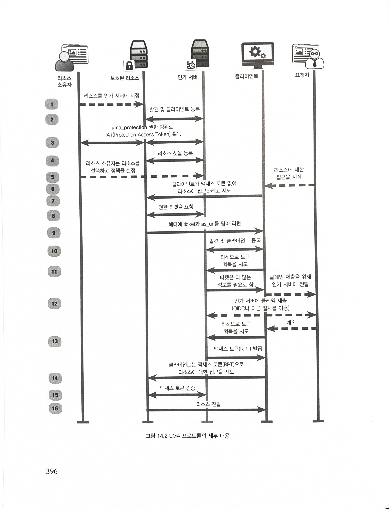

# Chapter 14. OAuth 2.0 을 이용하는 프로토콘과 프로파일

## 14.1 UMA(User Managed Access)

- OAuth 2.0 위에 구축되는 프로토콜로
- 리소스 소유자가 제어하는 소프트웨어나 다른 사용자가 제어하게 되는 소프트웨어에 대한 인가 서버를 사용함으로써 리소스 소유자가 자신의 리소스에 대한 풍부한 접근 통제를 할 수 있게 해줌
- OAuth 2.0 을 기반으로 UMA 프로토콜을 사용하면 두 가지 주요 기능을 구현할 수 있음
  - 사용자 간의 위임
  - 하나의 리소스 서버에 대해 여러 개의 인가 서버를 처리
- OAuth 2.0 은 리소스 소유자가 클라이언트 소프트웨어에 리소스 소유자처럼 행동할 수 있도록 권한을 인가하지만, UMA 는 리소스 소유자가 다른 사용자의 클라이언트 소프트웨어에 다른 사용자의 권한을 인가해주는 것

### 14.1.1 UMA 가 중요한 이유

- 사용자 간의 공유 관리와 인가 서버의 사용자 제어를 가능하게 해줌
- 리소스 소유자는 요청자의 리소스 접근을 허용할 수 있음
- 서로를 모두 알고 있는 정적인 환경에서도 잘 동작하지만, 인가된 구성 요소의 지시에 따라 실시간으로 구성 요소가 추가될 수도 있음
- 인가 서버에서 보호하는 리소스에 대한 레퍼런스를 리소스 서버가 등록하는 방법을 정의
  - 리소스 셋

### 14.1.2 UMA 프로토콜 동작 방식

1. 리소스 소유자는 인가 서버에 리소스 서버를 알림
2. 리소스 서버는 인가 서버의 설정을 발견하고 OAuth 클라이언트를 등록
   - `./well-known/uma-configuration`
3. 리소스 소유자는 리소스 서버를 인가
   - OAuth 와 마찬가지로 리소스 서버가 적절한 권한을 가진 액세스 토큰을 얻는 방법을 여러 가지지만, 리소스 소유자를 대신해 직접 수행되는 작업이기 떄문에 인가 코드 플로처럼 상호 작용을 통해 액세스 토큰을 얻는 것이 일반적\
   - 이 과정에서 리소스 서버가 얻는 액세스 토큰을 Protection API Token 이라고 함 
   - PAT 는 최소한 uma_protection 권한 범위를 가져야 하지만, 관련된 다른 권한 범위를 함께 가질 수 있음
4. 리소스 서버는 자신의 리소스 셋을 인가 서버에 등록
5. 리소스 소유자는 리소스 셋과 관련된 정책을 인가 서버에 설정
6. 요청자는 클라이언트에게 리소스 서버에 접근하라고 지시
7. 클라이언트가 보호된 리소스를 요청
8. 리소스 서버는 요청된 접근을 나타내기 위해 인가 서버에 권한 티켓을 요청하고 그것을 클라이언트에게 전달
9. 리소스 서버는 클라이언트에게 티켓과 인가 서버 정보를 전달
10. 클라이언트는 인가 서버의 설정을 발견하고 그것을 등록
11. 클라이언트는 액세스 토큰을 얻기 위해 티켓을 인가 서버에 전달
12. 클라이언트는 필요한 클레임을 인가 서버에 전달
13. 클라이언트는 토큰을 얻기 위해 티켓을 다시 전달
14. 클라이언트는 리소스 서버에 액세스 토큰을 전달
15. 리소스 서버는 토큰이 적합한 것인지 판단
16. 최종적으로, 클라이언트가 요청한 리소스가 클라이언트에게 전달

## 14.2 HEART

- OAuth 는 매우 유연하고 선택할 수 있는 것이 많기 때문에 서로 다른 시스템 간의 상호 운용성과 호환성을 보장하는 것이 어려움
- HEART 워킹 그룹의 목적은 헬스 케어 분야에 적합한 기존 기술 표준의 프로파일을 제공하면서 가능하면 널리 사용할 수 있는 표준과 호환성을 유지하는 것
- OAuth 와 OpenID 커넥트, UMA 기반 위에서 구축되고 있으며, 선택적인 기능을 제한하고 모범 사례를 체계화함으로써 독립적인 구현물 간의 보다 높은 보안성과 상호 운용성을 추구

### 14.2.1 HEART 가 중요한 이유

- HEART 프로파일은 주어진 분야, 즉 이 경우에는 헬스케어 분야에서의 보안성과 상호 운용성을 향상시키는 일련의 표준 중에서 가장 첫 번째
- 앞으로 많은 산업이 API 기반의 생태계로 이동할 것이므로 이런 유형의 프로파일링은 점차 보편화 될 것으로 보임
- 헬스 케어 분야에 대한 과거의 디지털화 노력과 달리, HEART 는 사용자, 특히 환자와 헬스케어 제공자에게 결정 능력과 통제력을 명시적으로 부여
- HEART 는 데이터와 통제 그리고 보안 의사 결정을 집중화하는 대신 데이터 생산자와 소비자의 요구에 따라 데이터를 안전하게 배포하고 연결할 수 있는 환경을 계획하고 만듦
- 환자는 자신의 애플리케이션을 가져와 자신의 건강 기록에 접근할 수 있어야 함
  - 헬스케어 제공자와 애플리케이션 개발자가 사전에 알고 있는지 여부와는 상관없이 이루어져야함
- 건강 기록은 매우 개인적이고 민감한 것이기 때문에 무엇보다 보안이 중요
