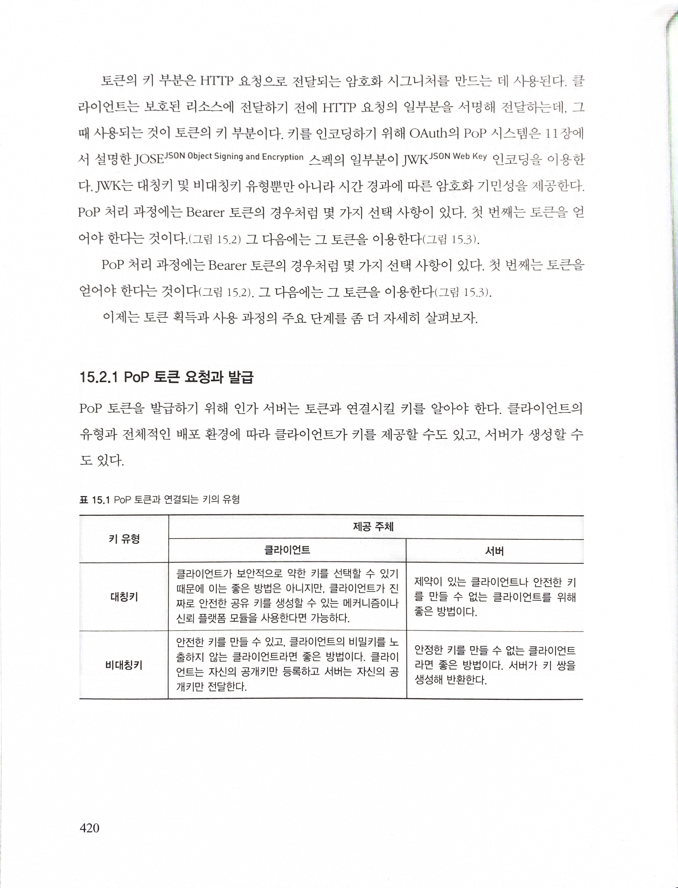

# Chapter 15. 그 외 토큰들

## 15.1 왜 Bearer 이외의 토큰이 필요할까?

- Bearer 토큰은 처리하기 위해 추가로 요구되는 것이 없으며 클라이언트에 대한 이해가 없어도 매우 간단히 처리 가능
- OAuth 2.0 은 클라이언트의 복잡도를 최대한 없애기 위해 설계됨
- 클라이언트는 인가 서버로부터 Bearer 토큰을 발급받은 다음에 그대로 리소스 서버에 전달하기만 하면 됨
- 여러가지 면에서 Bearer 토큰은 단지 특정 리소스를 위해 클라이언트에게 발급된 비밀번호
- 많은 경우, 이와 같은 형태의 토큰이 아닌, 즉 네트워크로 토큰을 전달하지 않고 클라이언트가 어떤 비밀 정보를 소유하고 있다고 증명하는 방식을 필요로 함
  - 그렇게 하면 공격자가 네트워크를 캡처할 수 있다고 하더라도 토큰을 얻을 수 없기 때문에 토큰을 재사용하는 공격을 수행할 수 없게 됨

## 15.2 PoP(Proof of Possession) 토큰

- 토큰 자체가 비밀 정보를 의미하는 Bearer 토큰과 달리, PoP 토큰은 토큰과 키라는 두 가지로 구성
- PoP 토큰을 갖고 있는 클라이언트는 토큰 자체 뿐만 아니라 키를 소유하고 있다는 것을 증명할 수 있어야 함
- 토큰은 요청과 함께 네트워크로 전송되지만, 키는 그렇지 않음
- 토큰 부분은 여러가지 면에서 Bearer 토큰과 유사
  - 클라이언트는 토큰이 보호된 리소스에 대한 접근 권한을 위임한다는 것 외에 토큰 자체나 그 안에 무엇이 포함돼 있는지 알지 못하거나 상관하지 않음
  - 클라이언트는 다른 경우와 마찬가지로 토큰 부분을 그대로 전달
- 토큰의 키 부분은 HTTP 요청으로 전달되는 암호화 시그니처를 만드는 데 사용
  - 클라이언트는 보호된 리소스에 전달하기 전에 HTTP 일부분을 서명해 전달하는데, 그때 사용되는 것이 토큰의 키 부분
  - 키를 인코딩하기 위해 OAuth 의 PoP 시스템은 JOSE 스펙의 일부분인 JWK 인코딩을 이용
  - JWK 는 대칭키 및 비대칭키 유형 뿐만 아니라 시간 경과에 따른 암호화 기민성을 제공

### 15.2.1 PoP 토큰 요청과 발급

## 15.4 TLS 토큰 바인딩

- 토큰 바인딩은 HTTP 와 같은 애플리케이션 계층의 프로토콜과 OAuth 와 같은 HTTP 상위에서 실행되는 프로토콜 내부에서 TLS 의 정보를 사용할 수 있게 해주는 방법
- HTTP 클라이언트가 HTTP 서버와읭 TLS 연결을 만들 때 클라이언트는 HTTP 헤더에 공개키(토큰-바인딩 식별자)를 포함시키고 자신이 그것과 연관된 비밀키를 갖고 있다는 것을 증명
